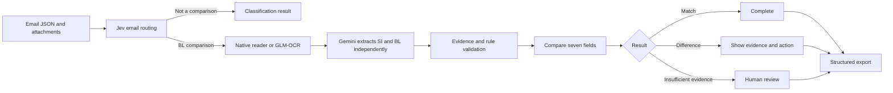

# Verity

**Evidence-linked SI–BL verification for shipping operations.**

Verity reads operational emails, identifies which messages require a Shipping Instruction (SI) and Draft Bill of Lading (BL) comparison, extracts seven critical fields, validates every extracted value against the source, and sends only unsupported decisions to a person.

**Team:** MumMumMumWeh

**Live prototype:** [verity-mummummumweh-workspace.xiaochen050825.chatgpt.site](https://verity-mummummumweh-workspace.xiaochen050825.chatgpt.site/)

## Why it exists

Finding a difference is only half the job. A container-count mismatch, a missing gross weight, an unreadable scan and multiple document versions require different responses. Verity keeps the issue, source evidence and next action together so reviewers do not have to search across emails and attachments or guess what to do next.

## Workflow



Jev reads the email subject and body. It classifies the message as `BL_COMPARISON`, `SI_REQUEST`, `INVOICE_QUERY`, `GENERAL` or `SPAM`. Low-confidence or conflicting routes are checked independently by Gemini. Jev does not read attachments.

For comparison requests, text-based PDF, DOCX, XLSX and TXT content is read directly. Scanned pages are transcribed with GLM-OCR, while Gemini independently extracts fields from the original page image. Deterministic rules validate the evidence before any comparison is accepted.

## Seven checked fields

- Shipper
- Consignee
- Notify party
- Port of loading
- Port of discharge
- Container count
- Gross weight

Every field is reported as a supported match, a confirmed difference, or an unresolved issue such as missing, unreadable or ambiguous evidence. Verity never converts missing evidence into a match.

## Full-dataset development validation

| Measure | Result |
|---|---:|
| Competition emails processed | **520** |
| Email classifications correct | **520 / 520** |
| Defect emails detected | **46 / 46** |
| Email-level false alarms | **0** |
| Routed directly by Jev | **66.5%** |
| Filtered before document comparison | **57.7%** |
| Completed without a pending action | **86.7%** |
| Official export rows produced | **520 / 520** |
| Active provider time | **136.18 seconds** |
| Estimated model cost | **US$0.5033** |

These are development-set results from the supplied 520-email dataset, not a held-out production guarantee. One email contained two official defect fields: Verity confirmed the container-count difference and conservatively routed a unitless weight difference for review. The time excludes upload and local file reading. Cost is estimated from recorded tokens and benchmark rates rather than a reconciled provider invoice.

## Technology

- **Frontend:** React 19, Motion, Radix UI, Vite
- **Runtime:** Cloudflare Worker-compatible server
- **Persistence:** D1 metadata and R2 originals
- **Routing:** TypeSafe Jev 1.13 with a second-account failover
- **Extraction:** Gemini 3.5 Flash Lite through Grafilab
- **Scan OCR:** GLM-OCR through Grafilab
- **Validation:** deterministic JavaScript rules, Zod contracts and grounded evidence checks
- **Document readers:** PDF.js, JSZip, DOCX and spreadsheet readers

## Run locally

### Requirements

- Node.js 20 or later
- npm
- A Cloudflare-compatible local Wrangler runtime
- Optional provider keys for the complete AI pipeline

### Setup

```bash
npm ci
copy .env.example .dev.vars
npx wrangler d1 migrations apply verity-local --local
npm run dev:server
```

In another terminal:

```bash
npm run dev
```

Open `http://127.0.0.1:5178`.

Without provider keys, Verity uses a conservative local parser and keeps uncertain cases visible. Add server-only keys to `.dev.vars` to run Jev, Gemini and GLM-OCR. Never place secrets in variables prefixed with `VITE_`.

## Configuration

| Variable | Purpose |
|---|---|
| `GRAFILAB_API_KEY` | Enables Gemini extraction and GLM-OCR |
| `GRAFILAB_MODEL` | Optional text model override |
| `GRAFILAB_VISION_MODEL` | Optional image model override |
| `GRAFILAB_OCR_MODEL` | Optional OCR model override |
| `TYPESAFE_API_KEY` | Primary Jev routing key |
| `TYPESAFE_BACKUP_API_KEY` | Backup Jev account key |
| `JEV_MODEL` | Optional tested Jev model override |
| `AI_BASE_URL`, `AI_MODEL`, `AI_API_KEY` | Generic OpenAI-compatible fallback |

## Verification

```bash
npm test
npm run build
```

The suite checks classification routing, document pairing, evidence grounding, numerical formats, company and port handling, targeted rereads, review-state boundaries, export behavior and prior regressions.

## Documentation

- [Technical documentation](docs/TECHNICAL_DOCUMENTATION.md)
- [Evaluation and generality notes](docs/generality-validation.md)
- [Human-review policy](docs/review-policy.md)
- [Port reference policy](docs/port-reference.md)

## Current limits

- A batch accepts up to 1,000 emails and 1,500 files; the queue scheduler has been tested with 10,000 synthetic tasks, but 10,000 real emails have not been production-load tested.
- The browser currently prepares source documents and must remain open while new cases are being submitted. Persisted cases can be resumed.
- TIFF and legacy Office formats stop with a clear unsupported-format result.
- Verity does not send messages, modify source documents, update an ERP or claim that the SI itself is factually correct.
- Human decisions remain case-specific and never silently become global matching rules.

## Repository structure

```text
src/        React interface, import flow and document readers
server/     API, persistence and authorization
engine/     Routing, extraction, validation, comparison and export
drizzle/    D1 database migrations
scripts/    Build and validation utilities
docs/       Technical, evaluation and review documentation
```

## Team

Built by **MumMumMumWeh** for the Averis × Monash Hackathon 2026.
