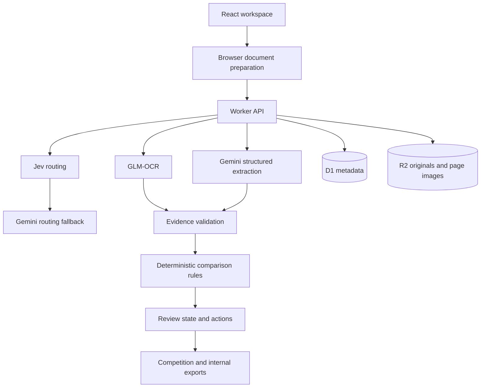

# Verity technical documentation

## 1. Product scope

Verity is an evidence-linked review workspace for operational shipping emails. It classifies each email, processes only genuine SI–BL comparison requests, extracts seven fields from the paired documents, validates the evidence, compares the values and presents the correct next action.

The system intentionally separates three outcomes:

- **MATCH:** the two documents contain supported equivalent values.
- **MISMATCH:** the two documents contain supported different values.
- **NEEDS REVIEW:** the evidence is missing, unreadable, ambiguous, conflicting or insufficient for a safe comparison.

`NEEDS REVIEW` is not treated as a defect and is never silently converted to a match.

## 2. Architecture



### Client

The React client imports the email JSON and linked attachments, reads supported native formats, prepares page images for scans and displays the task queue, evidence viewer, field comparison, issue-specific actions and export status.

Source preparation is bounded by file, page and text limits. Unsupported formats produce an explicit error. Original files remain unchanged.

### Server

The Worker owns classification, OCR calls, structured extraction, rule evaluation, reviewer actions and persistence. Secrets remain server-side. API reads and writes are scoped to the authenticated workspace user.

### Persistence

- **D1:** batches, cases, file metadata, decisions, revisions and processing state.
- **R2:** original file bytes and generated page images.
- **Optimistic revisions:** reject stale review updates.
- **Hash binding:** reader evidence remains associated with the original file and page sequence.

## 3. Processing pipeline

### 3.1 Import contract

Each input message contains an ID, subject, full body and zero or more attachment names:

```json
{
  "email_id": "email_001",
  "subject": "Please confirm the draft BL",
  "body": "Please check the attached SI and draft BL.",
  "attachments": [
    "attachments/email_001_SI.pdf",
    "attachments/email_001_BL.pdf"
  ]
}
```

Duplicate IDs, incomplete messages and missing attachment references are rejected before processing.

### 3.2 Email routing

Jev reads the subject and body and answers two bounded questions in parallel:

1. Choose one category: `BL_COMPARISON`, `SI_REQUEST`, `INVOICE_QUERY`, `GENERAL` or `SPAM`.
2. Estimate whether the current message requests a specific BL comparison.

The application accepts a Jev route only when its confidence, comparison-intent result, message coverage and keyword evidence agree. A low-confidence or conflicting route is sent to Gemini for an independent classification using the original email. The backup Jev key is reserved for provider failure or rate limiting; it is not used to repeat an uncertain judgment.

Only `BL_COMPARISON` continues to document comparison. Other messages finish as classification-only records.

### 3.3 Document reading

- Native PDF text, DOCX paragraphs and tables, XLSX cells and TXT are read directly.
- Scanned PDF pages and images are transcribed with GLM-OCR.
- Gemini receives the original scan image for independent extraction; the GLM transcript is not supplied as a second source of truth.
- TIFF and legacy Office formats stop explicitly.

### 3.4 Independent extraction

SI and BL are extracted independently. The model must return a strict JSON contract containing:

- Document type and booking evidence.
- Seven field values.
- A verbatim source quote and page number for every value.
- `OK`, `MISSING` or `AMBIGUOUS` extraction status.
- Structured name, qualifier and address components for organization fields.

Prompts treat all email and document content as untrusted data. A malformed response receives one schema-only repair attempt; facts are never supplied by the repair instruction.

### 3.5 Document pairing

Automatic pairing requires supported evidence such as compatible source references or an explicit current-message declaration identifying the only typed SI and BL attachments. File names alone never establish identity.

Multiple versions, conflicting references, quoted-history-only relationships and unknown co-occurrence remain unresolved until the reviewer chooses the pair.

### 3.6 Evidence validation

Before comparison, the engine confirms that:

- The quote exists in the correct source and page.
- The quote belongs to the correct label or table cell.
- Document type and booking evidence are internally consistent.
- Gross weight does not come from net-weight evidence.
- Values were not inferred from the opposite document.
- A model has not invented units, identifiers or missing facts.

One targeted visual reread is allowed for a suspicious field. It uses the original page image and is revalidated through the same rules.

### 3.7 Deterministic comparison

- **Numbers:** exact decimal arithmetic; no floating-point tolerance. Units and number formats require source support.
- **Container count:** positive integer only; expressions such as `6 × 40 HC` resolve to six containers.
- **Gross weight:** metric units are normalized when explicit. Missing units remain unresolved where they affect interpretation.
- **Companies:** entity names, qualifiers and bilateral address conflicts are preserved. There is no fuzzy auto-match.
- **Ports:** comparison uses a bounded, versioned alias and country map. Unknown qualifiers and name/code conflicts remain unresolved.

### 3.8 Review states

The UI selects the action from the reason for uncertainty:

| Condition | Primary action |
|---|---|
| Missing SI or BL | Upload the missing file |
| Unreadable scan | Upload a clearer version |
| Multiple versions | Select the correct SI and BL |
| Ambiguous number format | Confirm the source interpretation |
| Unknown port alias | Specify the location with evidence |
| Unclear company identity | Supply identity evidence |
| Incorrect extraction | Correct the field with evidence |
| Confirmed difference | Mark the difference as reviewed |
| Processing failure | Retry the failed stage |

Every state can remain unresolved. Confirming a mismatch records that a person reviewed it; it does not turn the mismatch into a match.

## 4. Export behavior

The internal export retains every case, source reference, field state, reviewer action and processing error.

The competition export follows the provided schema:

- Noncomparison categories export as classification-only results.
- A confirmed difference remains `MISMATCH` even when another field still requires review.
- Missing, unreadable and ambiguous sources stay separate from provider failures.
- Undefined mappings block the official export rather than guessing.

The current validated dataset produces 520 of 520 export rows.

## 5. AI responsibilities

| Component | Responsibility |
|---|---|
| Jev 1.13 | Fast, typed email-intent routing with confidence |
| Gemini 3.5 Flash Lite | Routing fallback and independent structured extraction |
| GLM-OCR | Text recognition for scanned pages and images |
| Deterministic engine | Evidence checks, normalization, comparison and export |
| Human reviewer | Unsupported business and source decisions |

The model never has authority to mark two values as equal by itself. AI proposes evidence; deterministic code validates and compares it.

## 6. Validation

### Development dataset

The complete supplied set contains 520 emails. The latest full provider run recorded:

| Measure | Result |
|---|---:|
| Provider requests | 909 successful requests plus a bounded two-call recovery |
| Active provider time | 136.18 seconds |
| Estimated model cost | US$0.5033 |
| Classification | 520 / 520 |
| Defect-email detection | 46 / 46 |
| Email-level false alarms | 0 |
| Exact official defect-field sets | 45 / 46 |
| Complete export | 520 / 520 rows |

The one non-exact field set was still surfaced to the reviewer: container count was confirmed as different while a unitless gross-weight difference remained pending unit confirmation.

These results measure the development set used during debugging. They do not establish accuracy on unseen production data. Time excludes upload and local file reading. Cost is estimated from recorded tokens and benchmark rates, not a final invoice.

### Generality checks

The engine includes 411 additional checks covering prior failures and counterexamples. Cases were replayed with renamed email IDs and file names to confirm that results do not depend on competition identifiers. No ground-truth labels, email IDs, named customers or expected answers are available to production logic.

The bounded queue was separately tested with 10,000 synthetic tasks for omission, duplication, concurrency limits, failure isolation and pause/resume behavior. This validates scheduling behavior, not real-document accuracy or production cloud capacity.

## 7. Challenges and decisions

### Similar-looking values are not always equivalent

`216950` and `215,950 KG` clearly differ numerically, but a missing unit changes what the source supports. Verity surfaces both values and requests confirmation rather than silently inventing the unit.

### Document names are unreliable

Attachment names can be wrong, generic or duplicated. The pipeline identifies documents from their content and preserves ambiguous cases for selection.

### AI extraction is not evidence by itself

Every extracted value must be grounded in the original source. This prevents a plausible model completion from becoming a false match.

### Accuracy and workload pull in opposite directions

Aggressive normalization reduces manual review but risks releasing an incorrect draft. Verity automates only supported comparisons and makes the remaining workload explicit.

## 8. Security and privacy

- Provider keys are server-only secrets.
- Original files are private workspace objects.
- Requests are scoped to the authenticated user.
- Same-origin writes and file ownership checks prevent cross-workspace access.
- Source files are never edited.
- Email and document content is treated as untrusted input rather than executable instructions.

## 9. Known limitations

- Current real-batch submission depends on an open browser tab; a production background queue is not yet implemented.
- The 520-email benchmark is a development regression set, not an unseen validation set.
- Provider cost has not been reconciled against a final invoice.
- Port aliases are intentionally bounded.
- TIFF and legacy Office formats are unsupported.
- No autonomous mailbox, notification or ERP integration is included.
- Verity verifies agreement with the SI; it does not prove that the SI itself is factually correct.

## 10. Future roadmap

1. Freeze the pipeline and evaluate unseen data from different companies, layouts, ports and number conventions.
2. Move batch submission to a durable background queue with workspace-wide rate limiting and recovery.
3. Add paginated workspace search and export for production-scale batches.
4. Expand document coverage only with measurable evidence and regression tests.
5. Pilot the review workflow with shipping operators and measure review time, correction rate and reviewer disagreement.

## 11. Local operation

See the repository [README](../README.md) for installation, configuration, tests and build commands.
